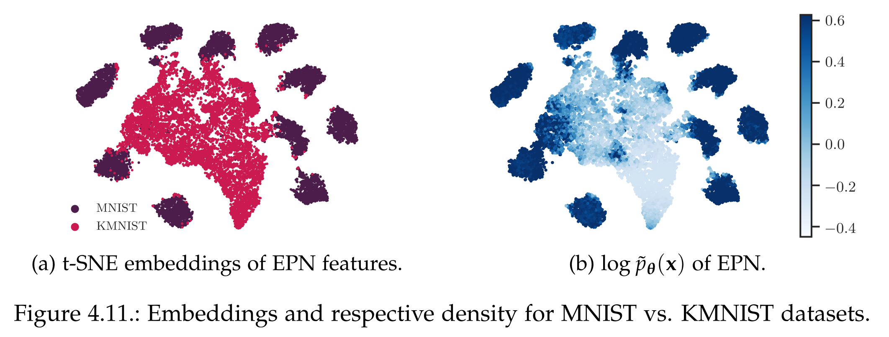
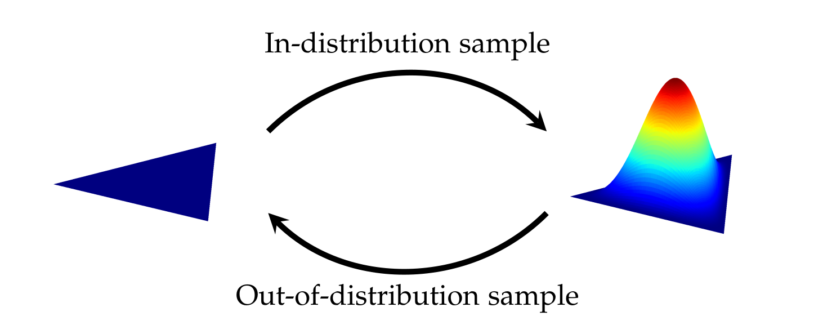

# Out-of-distribution Detection with Energy-based Models

This repository contains the code for my Master Thesis
> [Out-of-distribution Detection with Energy-based Models]() \
Sven Elflein \
Advisors: Bertrand Charpentier, Daniel Zügner \
Supervisor: Stephan Günnemann

<p align="center">
  
</p>

This repostory implements all baseline models considered in the thesis with one consistent interface using [PyTorch-Lightning](https://pytorch-lightning.readthedocs.io/en/latest/starter/new-project.html) for out-of-distribution detection, including

* [A Baseline for Detecting Misclassified and Out-of-Distribution Examples in Neural Networks](https://arxiv.org/abs/1610.02136)
    * Implementation: `uncertainty_est/models/ce_baseline.py`
    * Model Configuration: `fc_ce_baseline`, `img_ce_baseline`
* [Energy-based Out-of-distribution Detection](https://arxiv.org/abs/2010.03759)
    * Implementation: `uncertainty_est/models/energy_finetuning.py`
    * Model Configuration: `fc_energy_finetune`, `img_energy_finetune`
* [Simple and Scalable Predictive Uncertainty Estimation using Deep Ensembles](https://arxiv.org/abs/1612.01474)
    * Implementation: `uncertainty_est/models/deep_ensemble.py`
    * Model Configuration: Use `notebook/create_deep_ensemble_model.ipynb` to create from a set of models.
* [Your Classifier is Secretly an Energy Based Model and You Should Treat it Like One](https://arxiv.org/abs/1912.03263)
    * Implementation: `uncertainty_est/models/ebm/mcmc.py`, `uncertainty_est/models/ebm/vera.py` (for [VERA](https://arxiv.org/abs/2010.04230)-trained version)
    * Model Configuration: `fc_mcmc_supervised`, `img_mcmc_supervised`, `fc_vera_supervised`, `img_vera_supervised`
* [Dropout as a Bayesian Approximation: Representing Model Uncertainty in Deep Learning](https://arxiv.org/abs/1506.02142)
    * Implementation: `uncertainty_est/models/mc_dropout.py`
    * Model Configuration: `fc_mc_dropout`, `img_mc_dropout`
* [Deep Anomaly Detection with Outlier Exposure](https://arxiv.org/abs/1812.04606)
    * Implementation: `uncertainty_est/models/energy_finetuning.py`
    * Model Configuration: Use `fc_energy_finetune` or `img_energy_finetune` with `model_config.score=OE`
* [Posterior Network: Uncertainty Estimation without OOD Samples via Density-Based Pseudo-Counts](https://arxiv.org/abs/2006.09239)
    * Implementation: `uncertainty_est/models/postnet.py`
    * Model Configuration: `fc_postnet`, `img_postnet`
* [Reverse KL-Divergence Training of Prior Networks: Improved Uncertainty and Adversarial Robustness](https://arxiv.org/abs/1905.13472)
    * Implementation: `uncertainty_est/models/priornet/priornet.py`
    * Model Configuration: `fc_priornet`, `img_priornet`

Additionally, we include the implementation of our proposed model

* *Energy-Prior Networks (EPN)*
    * *EPN-V*
        * Implementation: `uncertainty_est/models/ebm/vera_priornet.py`
        * Model Configuration: `fc_vera_priornet`, `img_vera_priornet`
    * *EPN-M*
        * Implementation: `uncertainty_est/models/ebm/mcmc_priornet.py`
        * Model Configuration: `fc_mcmc_priornet`, `img_mcmc_priornet`

*Energy-Prior Networks* use a connection between the Energy in an EBM and the precision of the Dirichlet distribution in a Dirichlet Prior Network, hence the name. This allows optmization with EBM training algorithms without a seperate OOD dataset. EBM training can be interpret in EPN as optimizing the precision of the Dirichlet distribution:

<p align="center">
  
</p>

which allows OOD detection using distributional uncertainty as in Dirichlet Prior Networks. For more details see the thesis.


In the second part of the thesis (Section 4.2.), we investigate the properties of EBMs allowing better OOD detection (see results in [JEM](https://arxiv.org/abs/1912.03263)) than Normalizing Flows with prior insight from [Kirichenko, et. al.](https://arxiv.org/abs/2006.08545).

For this, we consider different EBM training algorithms

* [Sliced Score Matching: A Scalable Approach to Density and Score Estimation](https://arxiv.org/abs/1905.07088)
    * Implementation: `uncertainty_est/models/ebm/ssm.py`
    * Model Configuration: `fc_ssm`, `img_ssm`, `fc_ssm_supervised`, `img_ssm_supervised`
* Constrastive Divergence ([Training Products of Experts by Minimizing Contrastive Divergence](https://direct.mit.edu/neco/article/14/8/1771/6687/Training-Products-of-Experts-by-Minimizing))
    * Implementation: `uncertainty_est/models/ebm/mcmc.py`
    * Model Configuration: `fc_mcmc`, `img_mcmc`, `fc_mcmc_supervised`, `img_mcmc_supervised`
* VERA ([No MCMC for me: Amortized sampling for fast and stable training of energy-based models](https://arxiv.org/abs/2010.04230))
    * Implementation: `uncertainty_est/models/ebm/vera.py`
    * Model Configuration: `fc_vera`, `img_vera`, `fc_vera_supervised`, `img_vera_supervised`

For the baseline Normalizing Flow model, we use Glow on the image datasets and radial transformations on the tabular datasets.

* Glow ([Glow: Generative Flow with Invertible 1x1 Convolutions](https://arxiv.org/abs/1807.03039))
    * Implementation: `uncertainty_est/models/normalizing_flow/norm_flow.py`
    * Model Configuration: `img_glow`
* Normalizing Flow based on Radial transformations ([Variational Inference with Normalizing Flows](https://arxiv.org/abs/1505.05770))
    * Implementation: `uncertainty_est/models/normalizing_flow/norm_flow.py`
    * Model Configuration: `fc_norm_flow`


Finally, we considered different other approaches which we describe in the appendix

* [Conditional Noise-Contrastive Estimation of Unnormalised Models](http://proceedings.mlr.press/v80/ceylan18a.html) (Section A.4.1)
    * Implementation: `uncertainty_est/models/ebm/conditional_nce.py`
* [Invertible Residual Networks](https://arxiv.org/abs/1811.00995) (Section A.4.2)
    * Implementation: `uncertainty_est/models/normalizing_flow/iresnet.py`
* Approximate Flow (Section A.4.2)
    * Implementation: `uncertainty_est/models/normalizing_flow/approx_flow.py`
* Generating low-entropy samples using SGLD (Section A.4.3)
    * Implementation: `uncertainty_est/models/ebm/mcmc_entropy.py`
    * Model Configuration: `fc_mcmc_entropy`, `img_mcmc_entropy`


---

## Setup

Create a conda environment and install dependencies

```bash
conda create --name <env> --file requirements.txt
conda activate <env>
pip install git+https://github.com/selflein/nn_uncertainty_eval
```

Note that the datasets should be placed in `../data` relative to the root of this repository. Some datasets need to be downloaded manually:

* *Gaussian2D*, *Sensorless*, *Segment*: Download the CSV files from the [PostNet](https://github.com/sharpenb/Posterior-Network) repository
* Datasets with embeddings obtained from classifier: Download from [Google Drive](https://drive.google.com/file/d/1niGL-CkzVutjpM2zX9kfrbAH4Ke4tKGA/view?usp=sharing).
* *Textures*: From [here](https://github.com/abin24/Textures-Dataset)

All other datasets should download on first use.

## Training & Evaluation
In the following, we describe how to use this repository to train models.

### Training without SEML

In order to train a model use the respective combination of configurations for dataset and model, e.g.,

```bash
python uncertainty_est/train_local.py fixed.output_folder=./path/to/output/folder dataset=sensorless model=fc_mcmc
```

to train a EBM with MCMC on the Sensorless dataset. See `configs/model` for all model configurations and `configs/dataset` for the dataset configurations. Note that one should use the `img_*` models for the image datasets and `fc_*` models for the tabular and embedding datasets.

### Training with SEML
After setting up [SEML](https://github.com/TUM-DAML/seml), one can use the wrapper script to perform grid search. For example, use

```bash
python uncertainty_est/train_local.py fixed.output_folder=./path/to/output/folder dataset=sensorless model=fc_mcmc grid=seed
```

to train 5 EBMs with MCMC with different random seeds on the Sensorless dataset. Further, grid search configurations can be added in `configs/grid`.

### Evaluation

In order to evaluate models use

```
python uncertainty_est/evaluate.py --checkpoint-dir ./path/to/directory/with/models --output-folder ./path/to/output/folder [--eval-classification] [--max-eval <number>] [--config-entries some.key.in.config]
```

This script generates CSVs with the respective OOD metrics. Add `--eval-classification` as an argument to also store calibration and accuracy on the classification task on the in-distribution dataset. Finally, use `--max-eval <number>` to limit the amount of batches to evaluate and `--config-entries some.key.in.config` to add this configuration value to the output CSV.


## Acknowledgements

We use existing implementations for different models.

* RealNVP from https://github.com/chrischute/real-nvp
* Glow from https://github.com/chrischute/glow
* JEM from https://github.com/wgrathwohl/JEM
* VERA from https://github.com/wgrathwohl/VERA
* SSM from https://github.com/ermongroup/sliced_score_matching
* WideResNet from https://github.com/meliketoy/wide-resnet.pytorch
* Bi-Lipschitz WideResnet from https://github.com/omegafragger/DDU
* Posterior Network from https://github.com/sharpenb/Posterior-Network
* iResNet from https://github.com/jhjacobsen/invertible-resnet
